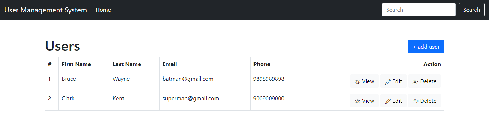

# Usermanagement App
* This is a usermanagement application.  
* We can access frontend to perform CRUD operations on mysql database
* Tech Stack -> Node / Express / Mysql  



# Install dependencies
The application needs following dependencies :
* Nginx
* MySQL
* Nodejs (and npm)
<br/>

# Initialize ```mysql``` database
* Run ```mysql-user-db.sh``` script. It takes new mysql username and password as paramerter.
* This script automatically creates a new mysql user, database ```usermanagement_tut```, table ```user``` and also inserts dummy data
* If you have existing mysql db running on other places (EC2, RDS, elsewhere), you can use ```user-schema.sql``` dump file to create database, table and dummy data. 

```
$ git clone https://github.com/anil-pict/myapp.git 
$ cd myapp/scripts
$ chmod +x mysql-user-db.sh
$ ./mysql-user-db.sh testuser test@123

    # Note-1 : ./mysql-user-db.sh <newMysqlUser> <userPassword>
    # Note-2 : while running the script, there will be prompt to provide password for 'root' mysql user. 
               The default password of mysql 'root' user is 'password'. 

```
<br/>

# Modify ```.env``` file
* Note : 
  * The frontend runs on port 5000 by default. If you need to run on different port, add "PORT" parameter to .env file eg, "PORT = 80"

```
DB_HOST = localhost
DB_NAME = usermanagement_tut
DB_USER = testuser
DB_PASS = test@123
```
<br>

# Run the application
```
$ npm install
$ npm start
```


